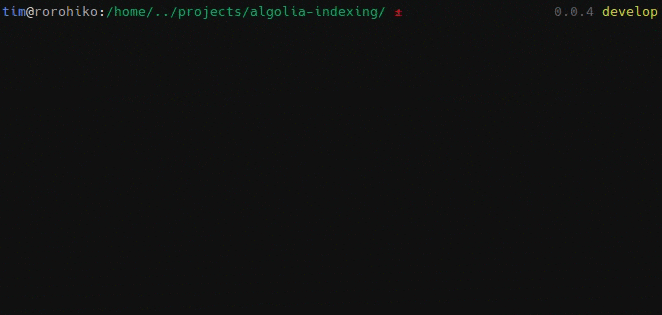

# algolia-indexing

This module will let you perform complex indexing operations with ease.

_⚠ This is still a heavy WIP and beta version_

It comes with two modes\*, each with their own pros and cons, for you to use
based on your needs. 

- The `fullAtomic` solution is the best method, but requires that you have
  a plan that can accommodate a large number of records (~2x the number of
  records in your index). 
- If you can't, you can use the `liveDiff` method instead that do not have this
  pre-requisite, but the drawback is that your update won't be atomic.

_\* Only the `fullAtomic` is implemented today._

## Installation

Install through `yarn` (or `npm`):

```
yarn add algolia-indexing
```

Then import into your JavaScript project with:

```javascript
import indexing from 'algolia-indexing';
```

## Full Atomic

```javascript
import indexing from 'algolia-indexing';

const credentials = { appId: 'XXX', apiKey: 'YYY', indexName: 'my_index' }
const records = [{foo: 'bar'}];
const settings = { searchableAttributes: ['foo'] };

await indexing.fullAtomic(credentials, records, settings);
```

This mode will update an index with new records and settings in an **atomic**
way. It will be **fast** but will require a plan with a **large number of
records** (as we'll need to duplicate the index for a short period of time).

How it works:

- Set a unique objectID to each record, based on its content
- Copy the production index to a temporary one
- Compare the new records and the existing records in the index
- Patch the temporary index by removing old records and adding new ones
- Overwrite production index with temporary one

To keep all processing fast, it uses a secondary index (called a manifest) to
store the list of objectIDs.

## Live Diff

This mode is similar to the full atomic, except that it will apply all
modifications directly on the production index, without using a temporary index.
This made it more suitable to run on plans where you're limited by the number of
records you might have. The drawback is that modifications won't be atomic but
incremental.

How it works:

- Set a unique objectID to each record, based on its content
- Compare the new records and the existing records in the index
- Patch the temporary index by removing old records and adding new ones

_Note: This mode is not yet implemented._

## `.verbose()`

By default, all methods are silent. By calling `indexing.verbose()`, you enable
the display of some progress indicators.



## Events

The module emits events at different points in time. You can listen to them and
react accordingly. Each event is fired with an object containing different
information relative to the event that fired it. 

All events have a specific key called `eventId` that is unique and shared across
events of the same origin. For example, a batch operation will emit
`batch:start` when starting, `batch:end` when finished and a certain number of
`batch:chunk` events depending on how large the batch is. All those events will
share the same `eventId`.

| event                                       | attributes                                   |
| --------------------------------------------|----------------------------------------------|
| `copyIndex:start`, `copyIndex:end`          | `source`, `destination`                      | 
| `moveIndex:start`, `moveIndex:end`          | `source`, `destination`                      | 
| `clearIndex:start`, `clearIndex:end`        | `indexName`                                  | 
| `setSettings:start`, `setSettings:end`      | `indexName`, `settings`                      |
| `getAllRecords:start`, `getAllRecords:page` | `indexName`, `currentPage`, `maxPages`       |
| `getAllRecords:end`                         | `indexName`                                  |
| `batch:start`, `batch:chunk`                | `currentOperationCount`, `maxOperationCount` |
| `batch:end`                                 |                                              |
| `error`                                     | `message`                                    |

## Config

`algolia-indexing` has sensible default configuration, but allows you to turn
knobs here and there.

The following table lists all the config keys and their default values. To
change a config value, you need to call `indexing.config({ keyToReplace:
'newValue' })`.

| Config                | Default Value | Description                                       |
|-----------------------|--------------:|---------------------------------------------------|
| `batchMaxSize`        | 100           | Number of operations to send in one batch at most. |
| `batchMaxConcurrency` | 10            | Number of batches do we run in parallel            |
